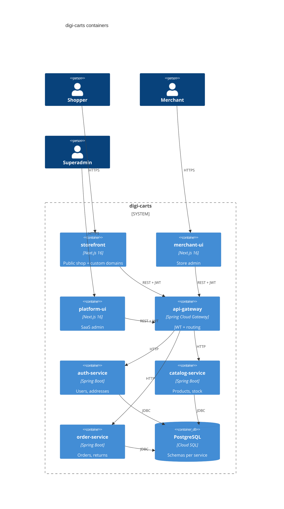

# C4 container view

See [system design](./system-design.md) for context.

Remaining Java containers (platform, notification, payment, shipping, store, storefront-service, offer, billing, audit) sit behind the same gateway and the same Cloud SQL instance with isolated schemas.

## Technology choices

| Layer | Choice | Why |
|-------|--------|-----|
| Edge | Spring Cloud Gateway | Reactive routing, global JWT filter |
| Domain | Spring Boot 3.3 / Java 21 | Org-wide backend after TS → Java migration |
| UI | Next.js 16 App Router | SSR/rewrites for multi-tenant hosts |
| DB | PostgreSQL + Liquibase | Strong migrations, jsonb for branding/specs |
| Runtime | Cloud Run | Scale-to-zero, per-repo CI |
