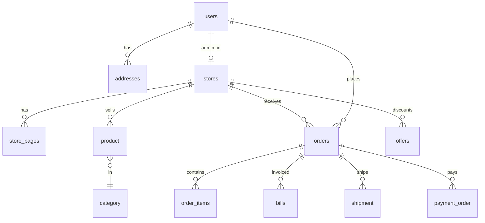

# Logical data model

PostgreSQL, one schema per service (except `store_svc` shared by store-service and storefront-service). Liquibase: `src/main/resources/db/changelog/` in each Java repo.

## Schema ownership

| Schema | Service | Core tables |
|--------|---------|-------------|
| `auth_svc` | [auth-service](https://github.com/digi-carts/auth-service/blob/stage/doc/README.md) | users, addresses, password_reset_tokens |
| `platform_svc` | [platform-service](https://github.com/digi-carts/platform-service/blob/stage/doc/README.md) | subscriptions, admin_users, platform_config, support_tickets, ticket_comments |
| `notif_svc` | [notification-service](https://github.com/digi-carts/notification-service/blob/stage/doc/README.md) | notification_config, notification_logs |
| `catalog_svc` | [catalog-service](https://github.com/digi-carts/catalog-service/blob/stage/doc/README.md) | product, category |
| `order_svc` | [order-service](https://github.com/digi-carts/order-service/blob/stage/doc/README.md) | orders, order_items, returns, return_items |
| `payment_svc` | [payment-service](https://github.com/digi-carts/payment-service/blob/stage/doc/README.md) | payment_order, store/platform payment config, processed webhooks |
| `shipping_svc` | [shipping-service](https://github.com/digi-carts/shipping-service/blob/stage/doc/README.md) | shipment, return_shipment, shipper/provider config, pincode_fallback |
| `store_svc` | [store-service](https://github.com/digi-carts/store-service/blob/stage/doc/README.md) + [storefront-service](https://github.com/digi-carts/storefront-service/blob/stage/doc/README.md) | stores, store_pages |
| `offer_svc` | [offer-service](https://github.com/digi-carts/offer-service/blob/stage/doc/README.md) | offers |
| `billing_svc` | [billing-service](https://github.com/digi-carts/billing-service/blob/stage/doc/README.md) | bills, bill_templates |
| `audit_log_svc` | [audit-log-service](https://github.com/digi-carts/audit-log-service/blob/stage/doc/README.md) | audit_log, audit_settings |

There are **no FK constraints across schemas**. References (`store_id`, `user_id`, `order_id`, `product_id`) are application-level.

## Enums (selected)

- User `Role`: `superadmin`, `merchant`, `user`
- `OrderStatus`: PENDING, PROCESSING, SHIPPED, DELIVERED, RECEIVED, CANCELLED
- `PaymentStatus`: CREATED, PAID, FAILED
- `PaymentType`: PRODUCT, SUBSCRIPTION

## Connection

`DATABASE_URL=jdbc:postgresql://{host}/{db}?currentSchema={schema}` plus Cloud SQL socket factory on Java services.
