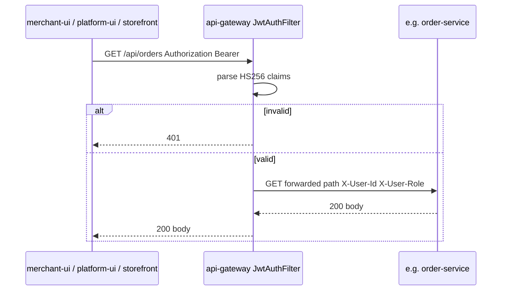
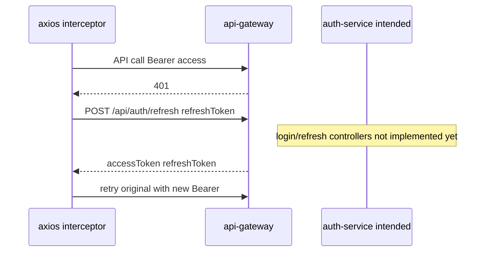
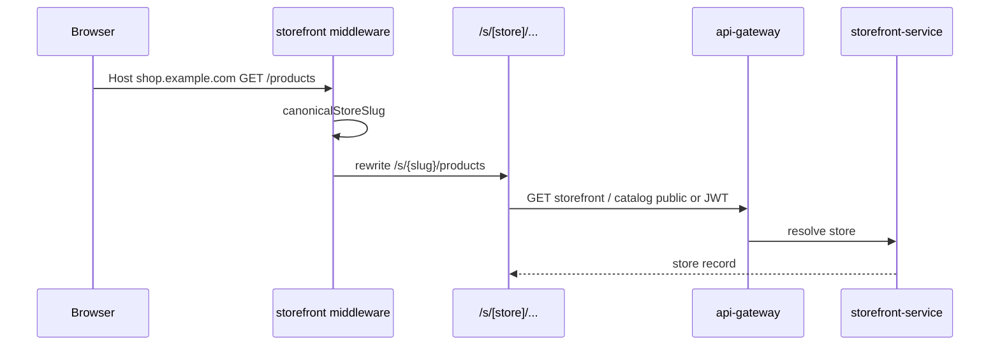
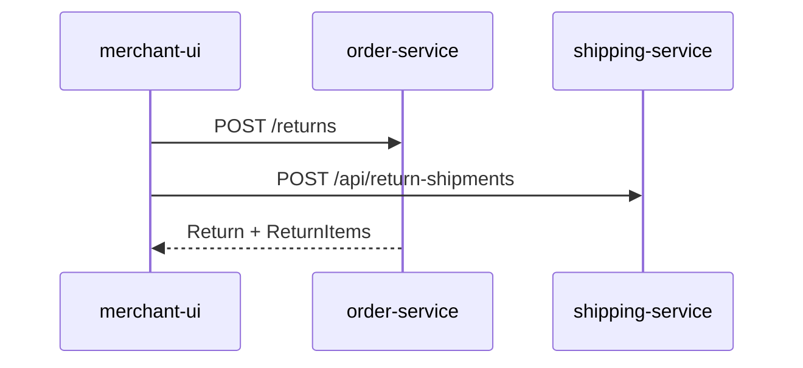

# Sequence diagrams

Companion to [system-design.md](system-design.md).

## JWT on a protected API

## Token refresh (frontend)

## Storefront custom domain

## Return / reverse logistics

See also checkout and onboarding in the system design document.
