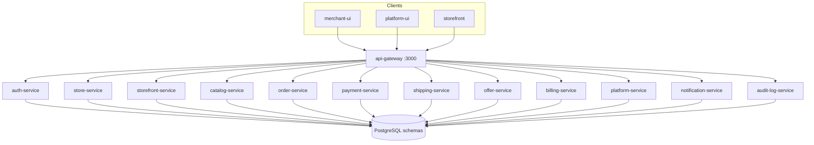
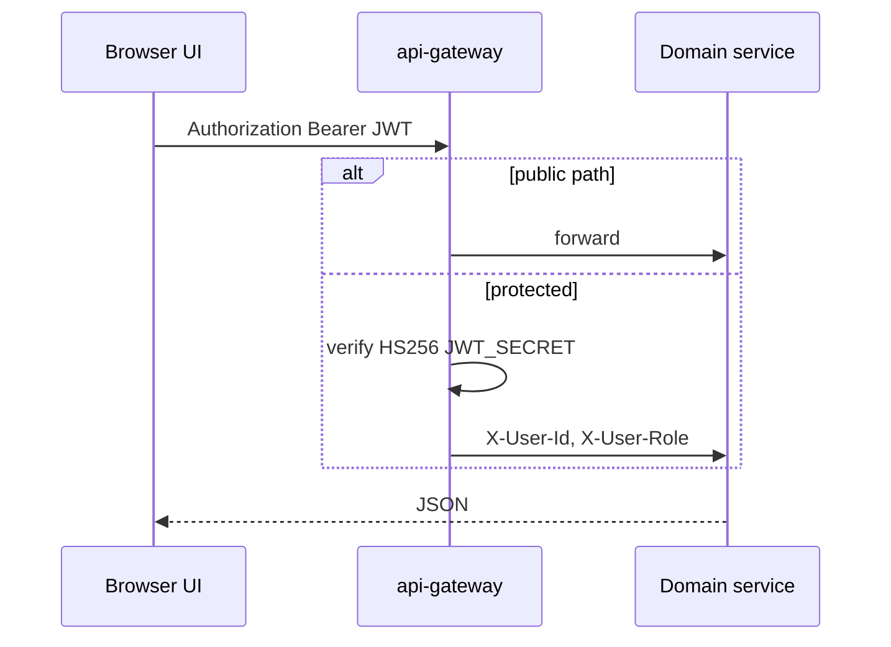
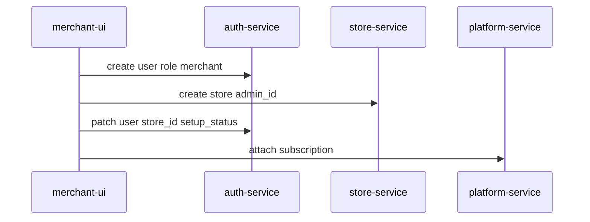

# digi-carts system design

Multi-tenant e-commerce SaaS: merchants run shops on **merchant-ui**, shoppers buy on **storefront**, operators run the network on **platform-ui**. All HTTP from browsers goes through **api-gateway**. Each Java service owns a PostgreSQL schema in a shared database (Liquibase). Runtime is Google Cloud Run (`digi-carts-dev` / `digi-carts`).

This document is the platform index. Per-service detail lives in each repo’s `doc/README.md` (links below).

## Contents

- [Context](#context)
- [Containers](#containers)
- [Request path and auth](#request-path-and-auth)
- [Tenancy](#tenancy)
- [Core flows](#core-flows)
- [Data ownership](#data-ownership)
- [Deployment](#deployment)
- [Known gaps](#known-gaps)
- [Repository docs](#repository-docs)

## Context



| Actor | App | Role claim |
|-------|-----|------------|
| Shopper | storefront | `user` |
| Store owner | merchant-ui | `merchant` |
| Platform operator | platform-ui | `superadmin` |

## Containers

| Layer | Tech |
|-------|------|
| Edge | Spring Cloud Gateway 2023.0.3, JJWT HMAC-SHA256 |
| Domain | Spring Boot 3.3.0 / Java 21 / JPA / Liquibase |
| Frontends | Next.js 16.3, React 19, axios, Zustand |
| Data | PostgreSQL 15+, one schema per bounded context |
| CI | GitHub Actions: `stage` → Cloud Run **dev**, `main` → release + **prod** |
| Registry | Artifact Registry `us-east1-docker.pkg.dev/{project}/digi-cart/` |

UIs set `NEXT_PUBLIC_API_URL` to the gateway `/api` prefix. Storefront also rewrites `/uploads/*` straight to catalog-service for product images.

## Request path and auth



Public paths today: `/api/auth/login`, `/api/auth/register`, `/api/auth/refresh`, `/api/storefront/**`, `/api/health`, `/actuator/**`.

Downstream services **do not re-verify JWT**; they optionally read gateway headers. Catalog additionally requires `x-store-id` (and sometimes `x-user-email` / `x-user-role`). Frontends send `x-store-id` from Zustand.

**Path alignment:** gateway predicates use `/api/...` prefixes. Many controllers are unprefixed (`/users`, `/orders`, `/products`). There is no `StripPrefix` filter. Production needs either rewrite filters or controller path updates. See [api-gateway doc](https://github.com/digi-carts/api-gateway/blob/stage/doc/README.md).

**Auth endpoints:** gateway and UIs expect `/api/auth/login|register|refresh`. auth-service currently exposes user/address/token CRUD (`/users`, …), not login controllers. JWT issuance must be completed there with the same `JWT_SECRET` as the gateway.

## Tenancy

- **Store** is the tenant. `store_id` appears on products, orders, offers, payments, shipments, bills, users (merchants), audit rows.
- Storefront: custom host → `canonicalStoreSlug` → rewrite `/s/{slug}/...`. Resolution uses storefront-service / store-service subdomain APIs (gateway public `/api/storefront/**`).
- merchant-ui persists `storeId` next to the access token.

`store-service` and `storefront-service` both use schema `store_svc`. Designate a single Liquibase owner per environment.

## Core flows

### Merchant onboarding



Setup wizard pages live on the user record (`setup_wizard_page`).

### Shop checkout (logical)

```mermaid
sequenceDiagram
  participant SF as storefront
  participant CAT as catalog-service
  participant OFF as offer-service
  participant ORD as order-service
  participant PAY as payment-service
  participant SHIP as shipping-service
  participant BILL as billing-service
  participant N as notification-service
  SF->>CAT: list products x-store-id
  SF->>OFF: GET /api/offers/code/{code}
  SF->>ORD: POST /orders
  SF->>CAT: POST /products/deduct-stock
  SF->>PAY: POST payment order Razorpay
  SF->>SHIP: POST shipment
  SF->>BILL: POST bill
  SF->>OFF: POST /api/offers/{id}/use
  Note over N: order-placed alerts when wired
```

There is **no saga orchestrator** in the backends; the UI (or a future workflow service) sequences calls. Cart is **client-side** (Zustand); gateway `/api/cart/**` has no cart controller.

### Superadmin

platform-ui CRUD against platform-service (plans, admin users, tickets, platform-config), plus payment/notification/store listing via their services.

## Data ownership

| Schema | Service | Aggregate |
|--------|---------|-----------|
| `auth_svc` | auth-service | User, Address, PasswordResetToken |
| `platform_svc` | platform-service | Subscription, AdminUser, PlatformConfig, SupportTicket |
| `notif_svc` | notification-service | NotificationConfig, NotificationLog |
| `catalog_svc` | catalog-service | Product, Category |
| `order_svc` | order-service | Order, OrderItem, Return |
| `payment_svc` | payment-service | PaymentOrder, payment configs, webhooks |
| `shipping_svc` | shipping-service | Shipment, configs, pincode fallback |
| `store_svc` | store-service **and** storefront-service | Store, StorePage |
| `offer_svc` | offer-service | Offer |
| `billing_svc` | billing-service | Bill, BillTemplate |
| `audit_log_svc` | audit-log-service | AuditLog, AuditSettings |

No Kafka/Rabbit in the current code; all integration is synchronous HTTP.

## Deployment

```
feature/* ──► stage ──► main
                │          │
           Cloud Run dev   Cloud Run prod + GitHub Release
```

Ports (local): gateway 3000, auth 3001, platform 3002, notification 3003, catalog 3004, order 3005, payment 3006, shipping 3007, store 3008, storefront-service 3009, offer 3010, billing 3011, audit 3012. UIs Docker **8080**.

Scripts in this repo: `scripts/setup-artifact-registry.sh`, `setup-cloud-run.sh`, `setup-cloud-sql.sh`, `update-service-urls.sh`, `set-repo-secrets.sh`. Operational backlog: [TODO.md](../TODO.md).

## Known gaps

Documented from current source, not a roadmap commitment:

1. Gateway path vs controller path mismatch; no StripPrefix.
2. auth-service missing login/register/refresh HTTP API that UIs already call.
3. Dual Liquibase on `store_svc`.
4. Checkout not orchestrated server-side; partial failure possible.
5. Audit logs not auto-emitted from gateway.
6. Frontend default `NEXT_PUBLIC_API_URL` still `localhost:4000` (legacy Node port).

## Repository docs

### Backend

| Service | Doc |
|---------|-----|
| api-gateway | https://github.com/digi-carts/api-gateway/blob/stage/doc/README.md |
| auth-service | https://github.com/digi-carts/auth-service/blob/stage/doc/README.md |
| platform-service | https://github.com/digi-carts/platform-service/blob/stage/doc/README.md |
| notification-service | https://github.com/digi-carts/notification-service/blob/stage/doc/README.md |
| catalog-service | https://github.com/digi-carts/catalog-service/blob/stage/doc/README.md |
| order-service | https://github.com/digi-carts/order-service/blob/stage/doc/README.md |
| payment-service | https://github.com/digi-carts/payment-service/blob/stage/doc/README.md |
| shipping-service | https://github.com/digi-carts/shipping-service/blob/stage/doc/README.md |
| store-service | https://github.com/digi-carts/store-service/blob/stage/doc/README.md |
| storefront-service | https://github.com/digi-carts/storefront-service/blob/stage/doc/README.md |
| offer-service | https://github.com/digi-carts/offer-service/blob/stage/doc/README.md |
| billing-service | https://github.com/digi-carts/billing-service/blob/stage/doc/README.md |
| audit-log-service | https://github.com/digi-carts/audit-log-service/blob/stage/doc/README.md |

### Frontends

| App | Doc |
|-----|-----|
| merchant-ui | https://github.com/digi-carts/merchant-ui/blob/stage/doc/README.md |
| platform-ui | https://github.com/digi-carts/platform-ui/blob/stage/doc/README.md |
| storefront | https://github.com/digi-carts/storefront/blob/stage/doc/README.md |

### This repo

| File | Purpose |
|------|---------|
| [architecture/system-design.md](system-design.md) | This document |
| [architecture/sequence-diagrams.md](sequence-diagrams.md) | Extra sequences |
| [architecture/c4-containers.md](c4-containers.md) | C4 container sketch |
| [architecture/data-model.md](data-model.md) | Cross-service ER |
| [architecture/service-catalog.md](service-catalog.md) | Link index to every `doc/README.md` |
| [README.md](../README.md) | Ops overview (ports, CI secrets, local run) |
| [TODO.md](../TODO.md) | Migration checklist |
